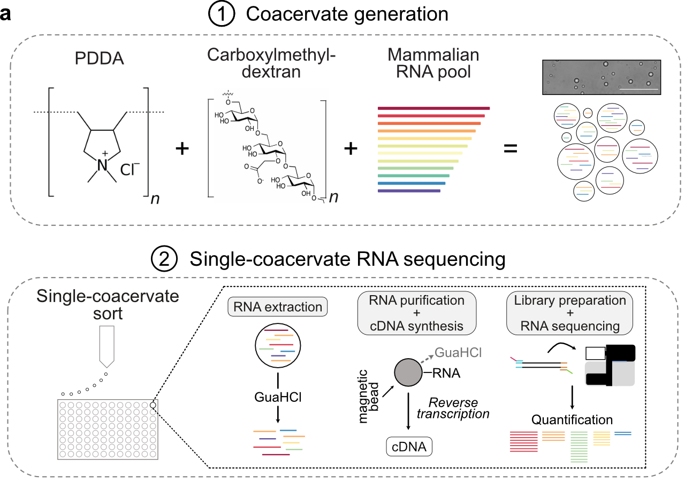

# Single-coacervate sequencing 

_____________________________________________

_____________________________________________

### Code 
This repository contains all code and files to reproduce the figures from our paper titled [Characterization of RNA content in individual phase-separated coacervate microdroplets](https://www.biorxiv.org/content/10.1101/2021.03.08.434405v1). 

### Wetlab
A detailed step-by-step protocol for the wetlab part of single-coacervate sequencing can be found [here](https://www.protocols.io/view/single-coacervate-sequencing-dm6gpw225lzp/v1)

### Contact
For any questions, please contact <damian.wollny@uni-jena.de>